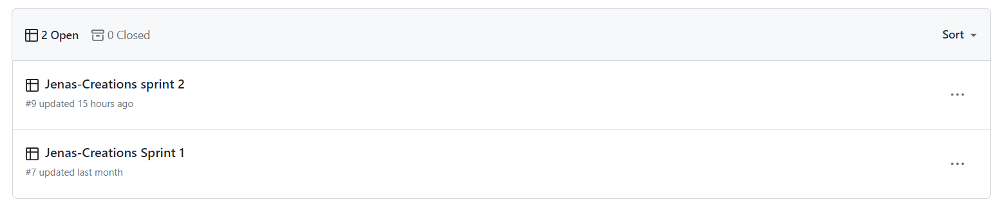

# Agile

## Introduction

Agile planning methodology was used to create the site Jenas Creations. GitHub projects was used to organise the development process into sprints, epics, Kanban boards and issues. The benefits of using agile methodology in this project include but are not limited to, having a plan in place, having a dedicated timeframe to achieve issues and overall organisation. I first started by creating Epics. These epics where created using GitHub milestones. Once the epic was created, detailed user stories where added which fit the criteria of the epic. Each user story had a detailed acceptance criteria and unit tasks associated with each issue. These issues where labelled using the MoSCoW technique. This project was completed over Two sprints of development. One sprint contained many epics and within this many issues.

## MoSCoW

MoSCoW analysis helps developers understand which tasks to prioritise. It is a process by which labels are added to issues. These labels include 'Must-have', 'Should-have' and ' Wont-have'. In my project I tried to ensure 'Should-have' prioritised user stories was not more than 60% of total user stories. On reflection, I did not use 'Wont-have' labels and prioritised more 'Must-have' and 'Should-have' labels. In future projects i would consider using more 'Wont-have' labels to detail the work that wont be prioritised during development. The image below shows a portion of the issues associated with this project and their labels in place.

## Epics

An agile epic is a body of work that can be broken down into smaller segments. Ten epics where created for this project. These epics where created using GitHub Milestones and each user story that corresponded to the epic was linked to each epic. The amount of user stories in each epic was depended on the project but they range from One to Six user stories. 

The Ten epics where:

1. [Profile Application](https://github.com/leoniemclaughlin7/jenas-creations/milestone/6?closed=1)

 

This epic was associated with the creation of a profile for the user. The users profile would house their default delivery information, which they can update and the users order history. 

2. [Custom Product Application](https://github.com/leoniemclaughlin7/jenas-creations/milestone/9?closed=1)

 

This epic revolved around setting up the ability of customers to checkout a custom order on the site. Users will fill in a form which will determine the price of their custom order, they can then add the custom order to their bag and change the quantity if desired and finally checkout their custom order.  

3. [Contact Application](https://github.com/leoniemclaughlin7/jenas-creations/milestone/10?closed=1)

 

This epic was associated with creating a form that the user can fill out in order to have any queries answered by admin of the site. 

4. [Review Products Application](https://github.com/leoniemclaughlin7/jenas-creations/milestone/8?closed=1)

 

This epic was associated with giving the users the ability to leave reviews on products. Users would also be able to edit or delete a review they have left. 

5. [Admin Product Management](https://github.com/leoniemclaughlin7/jenas-creations/milestone/7?closed=1)

 

This epic revolved around creating a space for admin to add, edit or  delete products from the site. It also was associated with displaying the messages left by users to admin, including their email so as admin could respond to queries. 

6. [Shopping Bag Application](https://github.com/leoniemclaughlin7/jenas-creations/milestone/4?closed=1)

 

This epic was associated with creating a shopping bag so as shoppers could add items to their bag before deciding to checkout. Within the shopping bag application shoppers could to decide to update the quantity of the item they selected or remove the item from their bag. 

7. [Viewing Products And Navigation](https://github.com/leoniemclaughlin7/jenas-creations/milestone/2?closed=1)

 

This epic resulted in users of the site having the ability to browse products available and the creation of the main and category navigation bar with the features listed in the features section of the readme. 

8. [Checkout Application](https://github.com/leoniemclaughlin7/jenas-creations/milestone/5?closed=1)

 

This epic is associated with users of the site having the ability to checkout the items that they have added to their bag. Payment was handled via Stripe and webhooks where implemented in order to ensure the order was created correctly. Shoppers also receive email confirmation of their order. 

9. [Sorting And Searching Products](https://github.com/leoniemclaughlin7/jenas-creations/milestone/3?closed=1)

 

This epic resulted in users of the site having the ability to sort products by price, either low to high or high to low. Displayed categories that the shopper is browsing in the navigation bar. It also handled the ability to search the site for keywords that would be found in the product name or description. 

10. [Account Registration ](https://github.com/leoniemclaughlin7/jenas-creations/milestone/1?closed=1)

 

This epic was associated with allowing users to create an account on the site. Users will be sent an email when the register for an account. Users can sign in using their google account and a forgotten password link is available to users. 

## User stories 

A user story is an explanation of a software feature written from the perspective of the end user. Its purpose is to articulate how a software feature will provide value to the customer. User stories were created with the help of GitHub issues. Each user story contains:
* Title - Short description of the user story. 
* Description - As a **role** I can **capability** so that **received benefit**.
* Acceptance criteria - A set of conditions that a feature must meet to be accepted by the user. 
* Unit tasks - A break down of each task needed to complete user story. 
* A MoSCoW label - To prioritise tasks. 
* Assignee -  Who the user store is assigned too. 
* Milestone - Which epic this user store is associated with.

Below is an example of how the user stories where structured for this project.

 

A full list of the 39 user stories associated with this project can be found [here.](https://github.com/leoniemclaughlin7/jenas-creations/issues?q=is%3Aissue+is%3Aclosed)

## Sprints

This project was broken down into Two sprints of development of a duration of approximately Four weeks each. On reflection, I could have further broken down the user stories into more sprints for the size of this project and have them at Two week duration each. 

### [Jenas Creations - sprint 1](https://github.com/users/leoniemclaughlin7/projects/7)

Sprint One of this project focused on Five epics. Account registration, sorting and searching products, viewing products and navigation, shopping bag application and checkout application. 

19 user stories completed during sprint 1 include:

* [Create an account on the site](https://github.com/users/leoniemclaughlin7/projects/7/views/1?pane=issue&itemId=51503553)
* [Login and logout](https://github.com/users/leoniemclaughlin7/projects/7/views/1?pane=issue&itemId=51503835)
* [Email confirmation after registering an account](https://github.com/users/leoniemclaughlin7/projects/7/views/1?pane=issue&itemId=51504848)
* [Sort products depending on price](https://github.com/users/leoniemclaughlin7/projects/7/views/1?pane=issue&itemId=52065807)
* [Sign in with social accounts](https://github.com/users/leoniemclaughlin7/projects/7/views/1?pane=issue&itemId=51544558)
* [Recover my password](https://github.com/users/leoniemclaughlin7/projects/7/views/1?pane=issue&itemId=51504063)
* [View a list of products](https://github.com/users/leoniemclaughlin7/projects/7/views/1?pane=issue&itemId=51671778)
*  [View individual product detail](https://github.com/users/leoniemclaughlin7/projects/7/views/1?pane=issue&itemId=51672316)
*  [Choose category of product to view](https://github.com/users/leoniemclaughlin7/projects/7/views/1?pane=issue&itemId=51805044)
*  [Search the products](https://github.com/users/leoniemclaughlin7/projects/7/views/1?pane=issue&itemId=52117411)
*  [Create quantity selector on product detail page](https://github.com/users/leoniemclaughlin7/projects/7/views/1?pane=issue&itemId=52319878)
* [Display categories individually on nav bar](https://github.com/users/leoniemclaughlin7/projects/7/views/1?pane=issue&itemId=52154105)
* [See search results and number returned](https://github.com/users/leoniemclaughlin7/projects/7/views/1?pane=issue&itemId=52152336)
* [Add products to the shopping bag app](https://github.com/users/leoniemclaughlin7/projects/7/views/1?pane=issue&itemId=52290341)
* [Viewing the bag](https://github.com/users/leoniemclaughlin7/projects/7/views/1?pane=issue&itemId=52450029)
* [Create the checkout app](https://github.com/users/leoniemclaughlin7/projects/7/views/1?pane=issue&itemId=52907076)
* [Making secure payments](https://github.com/users/leoniemclaughlin7/projects/7/views/1?pane=issue&itemId=53021253)
* [Confirm checkout](https://github.com/users/leoniemclaughlin7/projects/7/views/1?pane=issue&itemId=53144222)
* [Sending confirmation emails after checkout](https://github.com/users/leoniemclaughlin7/projects/7/views/1?pane=issue&itemId=53145041)

### [Jenas Creations - Sprint 2](https://github.com/users/leoniemclaughlin7/projects/9)

Sprint 2 of this project focused on the epics, custom product application, profile application, admin product management, contact application and review products application.

20 user stories completed during stint 2 include:

* [Save delivery information](https://github.com/users/leoniemclaughlin7/projects/9/views/1?pane=issue&itemId=53634984)
* [Save and view order history](https://github.com/users/leoniemclaughlin7/projects/9/views/1?pane=issue&itemId=54030068)
* [Add products via product management](https://github.com/users/leoniemclaughlin7/projects/9/views/1?pane=issue&itemId=54064515)
* [Update quantity of custom order](https://github.com/users/leoniemclaughlin7/projects/9/views/1?pane=issue&itemId=54663963)
* [Delete custom order from bag](https://github.com/users/leoniemclaughlin7/projects/9/views/1?pane=issue&itemId=54693752)
* [Edit products](https://github.com/users/leoniemclaughlin7/projects/9/views/1?pane=issue&itemId=54285518)
* [Delete products](https://github.com/users/leoniemclaughlin7/projects/9/views/1?pane=issue&itemId=54289357)
* [Review a product](https://github.com/users/leoniemclaughlin7/projects/9/views/1?pane=issue&itemId=54311244)
* [Edit reviews](https://github.com/users/leoniemclaughlin7/projects/9/views/1?pane=issue&itemId=54379245)
* [Delete review](https://github.com/users/leoniemclaughlin7/projects/9/views/1?pane=issue&itemId=54389901)
* [Add preferences for custom order](https://github.com/users/leoniemclaughlin7/projects/9/views/1?pane=issue&itemId=54391209)
* [Add custom order to bag](https://github.com/users/leoniemclaughlin7/projects/9/views/1?pane=issue&itemId=54397553)
* [Checkout custom order](https://github.com/users/leoniemclaughlin7/projects/9/views/1?pane=issue&itemId=54922483)
* [Contact admin of the site](https://github.com/users/leoniemclaughlin7/projects/9/views/1?pane=issue&itemId=55130071)
* [Add more than on custom order to bag](https://github.com/users/leoniemclaughlin7/projects/9/views/1?pane=issue&itemId=54950155)
* [See average rating in products](https://github.com/users/leoniemclaughlin7/projects/9/views/1?pane=issue&itemId=55469370)
* [Show the delivery costs](https://github.com/users/leoniemclaughlin7/projects/9/views/1?pane=issue&itemId=55702163)
* [Display messages to user](https://github.com/users/leoniemclaughlin7/projects/9/views/1?pane=issue&itemId=55718193)
* [View a miniature bag window when items are added to bag](https://github.com/users/leoniemclaughlin7/projects/9/views/1?pane=issue&itemId=55713966)
* [View messages left by users as admin](https://github.com/users/leoniemclaughlin7/projects/9/views/1?pane=issue&itemId=55848835)