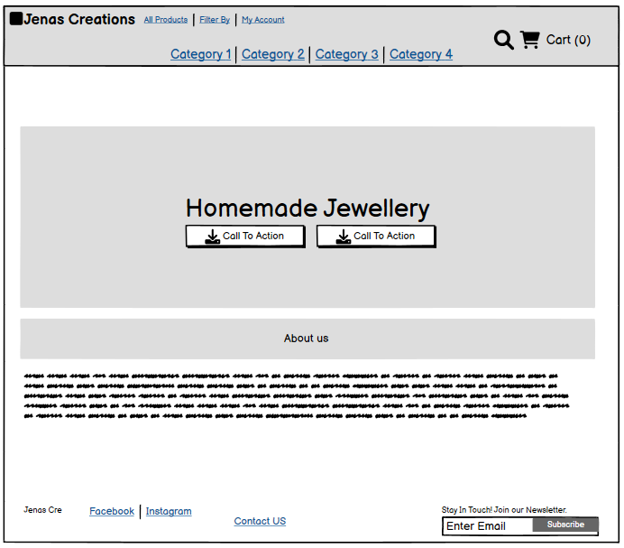

# Jenas Creations

Jenas Creations is an online homemade jewellery store. This e-commerce application allows shoppers to browse products that are on offer for sale from Four categories, bracelets, necklaces, earrings and phone charms. Shoppers can also create a custom product, choosing the category, material, colour scheme, personalisation and add a charm if they would like as well as including any additional details they feel are needed in order to make their product unique and a treasured piece in their collection. The application allows shoppers to add products and a custom order to their bag, checkout and receive email conformation of their order, as well as additional features such as leaving reviews on products, contact admin with any queries and search for specific products.   

A live version of the project can be accessed here: [Jenas Creations](https://jenas-creations-ad878282c6a4.herokuapp.com/)

# User Experience Design

## User Demographic

This website is intended for:

* Users that have a keen interest homemade jewellery.
* Users that would like to purchase homemade jewellery.
* Users that would like to have a custom order made for them.
* Users that are interested in browsing an online store and adding items to their bag.  

## User Stories

As a User of this website:

* I want to browse a selection of products available. 
* I want to be able to give my preferences for a custom order. 
* I want to purchase homemade jewellery. 
* I want to be able to leave a review of the product I purchased.
* I want to be able to contact site admin with any inquires I may have.
* I want to be able to manage my reviews.
* I want to be able to save my delivery information. 
* I want to be able to see my order history. 

## Entity Relationship Diagram

The entity relationship diagram for this application was generated from Django. A link to the tutorial on how to generate the diagram can be found in the credits section. Some considerations with this entity relationship diagram include the foreign key relationships. A foreign key relationship links Two tables, the column of One table is linked to the primary key of another table, allowing that table to access the information stored in the table with the foreign key relationship. Some key foreign key relationships in this entity relationship diagram is the relationship between user profile and order, connecting a user to an order. Orderlineitem table has Three foreign key relationships to custom order, order and product. Both custom order and product have a foreign key relationship to the category table and product has a foreign key relationship to the review table, ensuring the reviews are left for a specific product. 

## Wireframes

Wireframes were produced for the home, products, product detail, shopping bag, checkout and checkout success pages. These wireframes where used for reference when building the site, some aspects of the wireframes have changed as the website was being produced.

### Home

### Products

### Product Detail

### Shopping Bag

### Checkout

### Checkout Success 

## Design

The objective of this project was to design an e-commerce website that is easy to use and that has a clean layout whilst also sticking to the theme of the site which is homemade jewellery.  

### Colours

The colour palette for this website was created using [Coolors](https://coolors.co/fff7ad-ffa9f9-000000-cf4a72). The colours that where chosen complement each other while also having bright tones that complement the company's logo and the demographic of the artist making the homemade jewellery. Below you can see the colours that where used throughout the design of this website.

### Typography 

The fonts for the site where imported from Google fonts. For the headings [Madimi One](https://fonts.google.com/specimen/Madimi+One) was used. This font was chosen as it fit the aesthetic of the site, it has a homemade feel to it and complemented other design features. The font also has a second font of Sans-Serif set in case the chosen font dose not work on the users browser.  

# Agile

Jenas Creations was developed using Agile Development Methodology. A detailed overview of the Agile process is available [here.](../docs/AGILE.md)

[back to top](#jenas-creations)

# Technologies used

* <b>Python</b> - This application was developed using Python.
* <b>Django</b> - The Django framework was used to develop this application.
* <b>Django AllAuth</b> - Used to create account, login and logout users of the site.
* <b>PostgreSQL</b> - PostgreSQL from code institute was used to host the external database.  
* <b>Heroku</b> - Used for deployment.
* <b>GitHub</b> - The code for this application is stored on GitHub.
* <b>Git</b> - Used for version control.  
* <b>Gitpod</b> - IDE used for creating the application.
* <b>Bootstrap</b> - Bootstrap was used for the fast development of the layout and styling of Jenas Creations.
* <b>Font Awesome</b> - Icons where used to provide visual feedback.
* <b>HTML</b> - HTML was used to develop the templates in this project.
* <b>CSS</b> - Custom CSS was created to aid with the styling of Jenas Creations.
* <b>JavaScript</b> - Custom JavaScript was used in the development of this site.

# Features

## Existing features

### Navigation bar
* The navigation bar is present on all pages of this site.
* It contains Two sections the main navigation and a category navigation.
* In the main navigation there is a clickable logo titled Jenas Creations, which navigates to the home page when clicked.
* The clickable logo is fallowed by a link to All Products, followed by a dropdown menu titled Filter By, which allows the user to filter by price low to high or high to low. The final link in this section is a dropdown titled My Account. When the user is logged out the options are  Register and Login. When the user is logged in the dropdown options are Profile and Logout respectively. If admin is logged in to the site this dropdown also contains a link to the Admin Area.
* To the right hand side of the main navigation bar there is a search input box. This search box will allow users to search the products on the site for keywords. It searches the product name and description.  
* The last element in the main navigation bar is the users shopping cart. When items are added to the cart the price is displayed to the shopper.
* The category navigations contains links to the Four categories of products available on the site. When the user is browsing a certain category the category is highlighted in a dark pink colour to inform the user that they are browsing that category. 

### Hero image and text overlay

* The hero image contains the logo for Jenas Creations as well as a picture of the artist who makes the homemade jewellery. This gives a personal touch to the site. 
* Front and centre is a description of what the site contains 'Homemade Jewellery' and Two call to action buttons. A shop now button and a custom order button. 
* If the user has a custom order in their cart then only the shop now button will be displayed to the user.

### About us

* An about us section is evident on the home page, this gives the user some additional information about the creator and products available at Jenas Creations. 

### Register an account

* Users can sign up to Jenas Creations using the register page.
* If a user signs up they can leave a review on a product with edit and delete functionality, save their delivery information, view their profile where they can change their default delivery information and see their order history.
* In order to register the user must fill out a form that includes their username, an email address and a password.
* If a user tries to sign up with an email already in use they will be informed of this and asked to sign in.  

* The user will have to confirm their email address in order to sign up for an account.

### Sign in

* A login page is available in the My Account dropdown in the main navigation.
* A user must enter their username and password to sign in to Jenas Creations.
* If preferred a user can also sign in using google.
* There is a forgotten password link available to the user if needed.  

### Logout

* If the user wishes to logout of the site, they can do so by following the link in My Account section in the main navigation bar.
* The user will be asked to confirm they would like to logout.

### Products

* The All products link in the main navigation bar will display responsive cards with a clickable picture of the product, the products name and price.
* When the picture is clicked it navigates the user to the product detail page. 

### Product detail

* The product detail page contains a clickable image, which will open an enlarged version of the image in a new tab.
* The product name is displayed with a product description underneath.
* An average star rating from reviews left by users is displayed.
* The price and a quantity selector is evident. The quantity selector will only allow input form 1 to 50.
* Two call to action buttons follow this one for keep shopping and another to add the item to the bag. Once add to bag is selected it will add the quantity of the item chosen in the quantity selector to the users bag.

 

### Reviews 

* Reviews are visible in the product detail page under the details of the specific product for all users. 
* Logged in users have the option to leave a review on a specific product.
* Logged in users that own a review have the option to edit or delete their review. 

### Shopping bag

* The shopping bag houses details of the item the user has added to their bag. 
* The product image is evident or if its a custom order the category of product is displayed.
* The product name is available as well as the individual price and the subtotal, which will change depending on the quantity selected.
* There is a quantity selector with an update and remove button, which allows the user to update their quantity of the item or remove it from the bag.
* In the bottom right of the screen the bag total, delivery cost and grand total is displayed to the user followed by Two buttons, keep shopping or secure checkout. 

### Checkout

* The checkout page contains an order summary to the left and a checkout form on the right. 
* The order summary displays which products the user would like to purchase as well as the order total, delivery and grand total for the order. 
* The check out form first asks for details such as name, email and phone number. 
* The second section of the checkout form asks users to confirm their delivery details. Users have the option to save their delivery details if they are logged into the site, if they are logged out a link to sign up is displayed and details that if the user signs in they can save their default delivery information. 

* As part of the checkout form discussed above there is a payment section, provided by Stripe.
* Two call to action buttons are available under the payment input. These are adjust bag or complete order. 
* The final section in the checkout page is a notification highlighted in red, to the user that their card will be charged x amount.

### Checkout success

* The checkout success page first thanks the user for their order. This is followed by order confirmation details, such as order number, date and confirmation of the email in which the email confirmation will be sent.
* Under this section there is a summary of the order placed, keeping the user informed about what they have purchased. 
* The final section is a confirmation of the shoppers delivery address.
*  

# Credits 
Connecting social accounts: https://www.marinamele.com/user-authentication-with-google-using-django-allauth
Django order_by: https://stackoverflow.com/questions/9834038/django-order-by-query-set-ascending-and-descending 
Django filter: https://www.w3schools.com/django/django_queryset_filter.php 
overflow-wrap: https://www.w3schools.com/cssref/css3_pr_overflow-wrap.php
Convert object: https://www.geeksforgeeks.org/convert-object-to-string-in-python/ 
positive integer field: https://www.geeksforgeeks.org/positiveintegerfield-django-models/
Clean method on django models: https://docs.djangoproject.com/en/5.0/ref/forms/validation/ 
Save method django: https://docs.djangoproject.com/en/5.0/topics/db/models/
Retrieving a single object with get(): https://docs.djangoproject.com/en/5.0/topics/db/queries/
Python get method call: https://www.w3schools.com/python/ref_dictionary_get.asp
Finding the average: https://docs.djangoproject.com/en/5.0/topics/db/aggregation/ 
Toasts: https://getbootstrap.com/docs/5.3/components/toasts/#events
Fix footer to bottom with flex: https://stackoverflow.com/questions/55541850/how-to-make-footer-stay-at-bottom-of-the-page-with-flex-box 
ERD: https://www.wplogout.com/export-database-diagrams-erd-from-django/

# Images

## Braceletes
https://i.etsystatic.com/27283872/r/il/525dc1/2804553214/il_fullxfull.2804553214_nhj2.jpg

https://i.pinimg.com/originals/f1/9c/aa/f19caa86a38c7a3e06748852d209178c.jpg

https://i.pinimg.com/originals/d0/0e/65/d00e65e5a757c741c6e2859c0bb02eb3.jpg

https://i.pinimg.com/originals/7d/16/4d/7d164df902d9ec8407acaeb8b191d08f.jpg

https://i.pinimg.com/originals/f9/6b/83/f96b83ad835da2d7a8b52ded28a5222b.jpg

https://i.pinimg.com/originals/59/66/72/59667237b23aa86ed09c79e6b5726f9b.jpg

https://assets0.mirraw.com/images/6934949/image_zoom.jpeg?1555137275

https://m.media-amazon.com/images/I/41Nnf+goGCL._AC_UL480_FMwebp_QL65_.jpg

https://m.media-amazon.com/images/I/51q0-VmHVyL._AC_UL480_FMwebp_QL65_.jpg

https://m.media-amazon.com/images/I/51OSJXrvY7L._AC_UL480_FMwebp_QL65_.jpg

## phone charms

https://m.media-amazon.com/images/I/41Dl58NBIyL._AC_SL1200_.jpg
https://m.media-amazon.com/images/I/61RB2XZksQL._AC_UY327_FMwebp_QL65_.jpg
https://m.media-amazon.com/images/I/41gFO23fydL._AC_UY327_FMwebp_QL65_.jpg
https://m.media-amazon.com/images/I/41KD2QtLx1L._AC_UY327_QL65_.jpg
https://m.media-amazon.com/images/I/41iIKG0OtFL._AC_UY327_QL65_.jpg

## earrings

https://tse2.mm.bing.net/th?id=OIP.GGT6wY-Ol-V8dXPSxEOASwHaF7&pid=Api&P=0&h=180
https://tse2.mm.bing.net/th?id=OIP.Z3xTA7IfeYTu3RI0N6NaGQHaHb&pid=Api&P=0&h=180
https://tse1.mm.bing.net/th?id=OIP.BsidtET6rAGPXQx6lQioJAHaId&pid=Api&P=0&h=180
https://tse2.mm.bing.net/th?id=OIP.fm7hSfSuuAy4EflCxy1IwAHaHa&pid=Api&P=0&h=180
https://tse3.mm.bing.net/th?id=OIP.RtMWbbyhw076mNZRqglcLwHaGL&pid=Api&P=0&h=180

## necklaces
https://tse1.explicit.bing.net/th?id=OIP.ar88vVAbALTNiKY85s_TqAHaFj&pid=Api&P=0&h=180

https://tse1.explicit.bing.net/th?id=OIP.S25_e6wwy0Lr7vZEhdsOjQHaHa&pid=Api&P=0&h=180
https://tse1.mm.bing.net/th?id=OIP.vBH6ZjmBCKl8-Hc33gAmEgHaHa&pid=Api&P=0&h=180
https://tse4.mm.bing.net/th?id=OIP.okybC0DHVP6FJ8Tx5x2hOQHaJ5&pid=Api&P=0&h=180
https://tse1.mm.bing.net/th?id=OIP.4lPxe2gW9elzY-YwdHp6uwHaJ4&pid=Api&P=0&h=180

