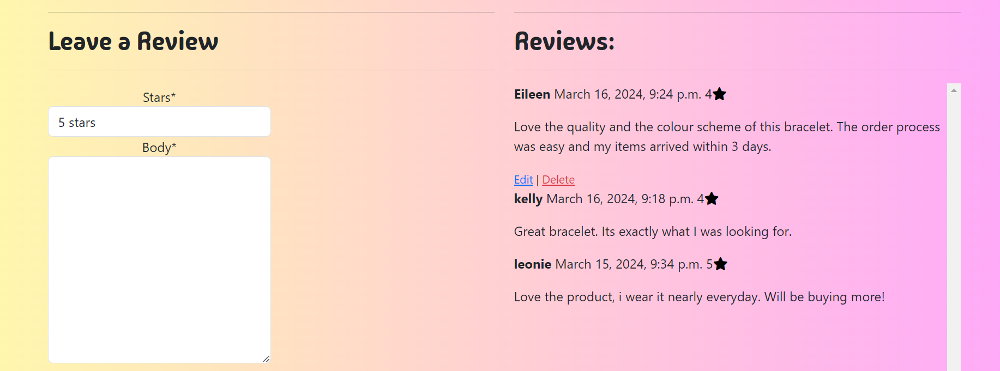

# Jenas Creations

Jenas Creations is an online homemade jewellery store. This e-commerce application allows shoppers to browse products that are on offer for sale from Four categories, bracelets, necklaces, earrings and phone charms. Shoppers can also create a custom product, choosing the category, material, colour scheme, personalisation and add a charm if they would like as well as including any additional details they feel are needed in order to make their product unique and a treasured piece in their collection. The application allows shoppers to add products and a custom order to their bag, checkout and receive email conformation of their order, as well as additional features such as leaving reviews on products, contact admin with any queries and search for specific products.   

A live version of the project can be accessed here: [Jenas Creations](https://jenas-creations-ad878282c6a4.herokuapp.com/)


# User Experience Design

## User Demographic

This website is intended for:

* Users that have a keen interest homemade jewellery.
* Users that would like to purchase homemade jewellery.
* Users that would like to have a custom order made for them.
* Users that are interested in browsing an online store and adding items to their bag.  

## User Stories

As a User of this website:

* I want to browse a selection of products available. 
* I want to be able to give my preferences for a custom order. 
* I want to purchase homemade jewellery. 
* I want to be able to leave a review of the product I purchased.
* I want to be able to contact site admin with any inquires I may have.
* I want to be able to manage my reviews.
* I want to be able to save my delivery information. 
* I want to be able to see my order history. 

## Entity Relationship Diagram

The entity relationship diagram for this application was generated from Django. A link to the tutorial on how to generate the diagram can be found in the credits section. Some considerations with this entity relationship diagram include the foreign key relationships. A foreign key relationship links Two tables, the column of One table is linked to the primary key of another table, allowing that table to access the information stored in the table with the foreign key relationship. Some key foreign key relationships in this entity relationship diagram is the relationship between user profile and order, connecting a user to an order. Orderlineitem table has Three foreign key relationships to custom order, order and product. Both custom order and product have a foreign key relationship to the category table and product has a foreign key relationship to the review table, ensuring the reviews are left for a specific product. 


## Wireframes

Wireframes were produced for the home, products, product detail, shopping bag, checkout and checkout success pages. These wireframes where used for reference when building the site, some aspects of the wireframes have changed as the website was being produced.

### Home


### Products


### Product Detail


### Shopping Bag


### Checkout


### Checkout Success 


## Design

The objective of this project was to design an e-commerce website that is easy to use and that has a clean layout whilst also sticking to the theme of the site which is homemade jewellery.  

### Colours

The colour palette for this website was created using [Coolors](https://coolors.co/fff7ad-ffa9f9-000000-cf4a72). The colours that where chosen complement each other while also having bright tones that complement the company's logo and the demographic of the artist making the homemade jewellery. Below you can see the colours that where used throughout the design of this website.


### Typography 

The fonts for the site where imported from Google fonts. For the headings [Madimi One](https://fonts.google.com/specimen/Madimi+One) was used. This font was chosen as it fit the aesthetic of the site, it has a homemade feel to it and complemented other design features. The font also has a second font of Sans-Serif set in case the chosen font dose not work on the users browser.  

# Agile

Jenas Creations was developed using Agile Development Methodology. A detailed overview of the Agile process is available [here.](../docs/AGILE.md)

[back to top](#jenas-creations)

# Technologies used

* <b>Python</b> - This application was developed using Python.
* <b>Django</b> - The Django framework was used to develop this application.
* <b>Django AllAuth</b> - Used to create account, login and logout users of the site.
* <b>PostgreSQL</b> - PostgreSQL from code institute was used to host the external database.  
* <b>Heroku</b> - Used for deployment.
* <b>GitHub</b> - The code for this application is stored on GitHub.
* <b>Git</b> - Used for version control.  
* <b>Gitpod</b> - IDE used for creating the application.
* <b>Bootstrap</b> - Bootstrap was used for the fast development of the layout and styling of Jenas Creations.
* <b>Font Awesome</b> - Icons where used to provide visual feedback.
* <b>HTML</b> - HTML was used to develop the templates in this project.
* <b>CSS</b> - Custom CSS was created to aid with the styling of Jenas Creations.
* <b>JavaScript</b> - Custom JavaScript was used in the development of this site.

# Features

## Existing features

### Navigation bar
* The navigation bar is present on all pages of this site.
* It contains Two sections the main navigation and a category navigation.
* In the main navigation there is a clickable logo titled Jenas Creations, which navigates to the home page when clicked.
* The clickable logo is fallowed by a link to All Products, followed by a dropdown menu titled Filter By, which allows the user to filter by price low to high or high to low. The final link in this section is a dropdown titled My Account. When the user is logged out the options are  Register and Login. When the user is logged in the dropdown options are Profile and Logout respectively. If admin is logged in to the site this dropdown also contains a link to the Admin Area.
* To the right hand side of the main navigation bar there is a search input box. This search box will allow users to search the products on the site for keywords. It searches the product name and description.  
* The last element in the main navigation bar is the users shopping cart. When items are added to the cart the price is displayed to the shopper.
* The category navigations contains links to the Four categories of products available on the site. When the user is browsing a certain category the category is highlighted in a dark pink colour to inform the user that they are browsing that category. 


### Hero image and text overlay

* The hero image contains the logo for Jenas Creations as well as a picture of the artist who makes the homemade jewellery. This gives a personal touch to the site. 
* Front and centre is a description of what the site contains 'Homemade Jewellery' and Two call to action buttons. A shop now button and a custom order button. 
* If the user has a custom order in their cart then only the shop now button will be displayed to the user.


### About us

* An about us section is evident on the home page, this gives the user some additional information about the creator and products available at Jenas Creations. 


### Register an account

* Users can sign up to Jenas Creations using the register page.
* If a user signs up they can leave a review on a product with edit and delete functionality, save their delivery information, view their profile where they can change their default delivery information and see their order history.
* In order to register the user must fill out a form that includes their username, an email address and a password.
* If a user tries to sign up with an email already in use they will be informed of this and asked to sign in.  


* The user will have to confirm their email address in order to sign up for an account.


### Sign in

* A login page is available in the My Account dropdown in the main navigation.
* A user must enter their username and password to sign in to Jenas Creations.
* If preferred a user can also sign in using google.
* There is a forgotten password link available to the user if needed.  


### Logout

* If the user wishes to logout of the site, they can do so by following the link in My Account section in the main navigation bar.
* The user will be asked to confirm they would like to logout.


### Products

* The All products link in the main navigation bar will display responsive cards with a clickable picture of the product, the products name and price.
* When the picture is clicked it navigates the user to the product detail page. 


### Product detail

* The product detail page contains a clickable image, which will open an enlarged version of the image in a new tab.
* The product name is displayed with a product description underneath.
* An average star rating from reviews left by users is displayed.
* The price and a quantity selector is evident. The quantity selector will only allow input form 1 to 50.
* Two call to action buttons follow this one for keep shopping and another to add the item to the bag. Once add to bag is selected it will add the quantity of the item chosen in the quantity selector to the users bag.

 

### Reviews 

* Reviews are visible in the product detail page under the details of the specific product for all users. 
* Logged in users have the option to leave a review on a specific product.
* Logged in users that own a review have the option to edit or delete their review. 



### Shopping bag

* The shopping bag houses details of the item the user has added to their bag. 
* The product image is evident or if its a custom order the category of product is displayed.
* The product name is available as well as the individual price and the subtotal, which will change depending on the quantity selected.
* There is a quantity selector with an update and remove button, which allows the user to update their quantity of the item or remove it from the bag.
* In the bottom right of the screen the bag total, delivery cost and grand total is displayed to the user followed by Two buttons, keep shopping or secure checkout. 


### Checkout

* The checkout page contains an order summary to the left and a checkout form on the right. 
* The order summary displays which products the user would like to purchase as well as the order total, delivery and grand total for the order. 
* The check out form first asks for details such as name, email and phone number. 
* The second section of the checkout form asks users to confirm their delivery details. Users have the option to save their delivery details if they are logged into the site, if they are logged out a link to sign up is displayed and details that if the user signs in they can save their default delivery information. 


* As part of the checkout form discussed above there is a payment section, provided by Stripe.
* Two call to action buttons are available under the payment input. These are adjust bag or complete order. 
* The final section in the checkout page is a notification highlighted in red, to the user that their card will be charged x amount.


### Checkout success

* The checkout success page first thanks the user for their order. This is followed by order confirmation details, such as order number, date and confirmation of the email in which the email confirmation will be sent.
* Under this section there is a summary of the order placed, keeping the user informed about what they have purchased. 
* The final section is a confirmation of the shoppers delivery address.


### Profile 

* The profile page houses the users default delivery information if they opted to save this when checking out. 
* Users can update their information from this page by clicking the update information button. 


* From the profile page users can also see their order history.
* The order history includes the date, grand total, order number and items. The order number is clickable and brings the user to the checkout success page with the details of their order displayed. 


### Admin area 

* The admin area can only be accessed if a superuser is logged into the site. It is accessible through the My Account dropdown in the main navigation bar. 
* Within the admin area superusers can add products to the store. 
* In order to add a product admin must fill in a form with the fields category, name, description, price, image URL and image.
* Form validation is in place for the price field.  


* When admin is logged in options to edit or delete products is available in the main product page and within the product detail page. 


* Within the admin area, user queries are also displayed. 
* These queries contain the name of the user, the date and time, an email for the user and the message. 


### Footer 

* The footer is evident on all pages of the site.
* The footer contains copyright information, links to the Facebook and Instagram page, a contact us link and a subscription box via Mailchimp for email marketing purposes.


### Contact us

* The contact us link in the footer is clickable and brings the user to a contact form. 
* Information such as name, email address and message is required to fill in this form.
* The email field in this form is validated and expects an email, a message will be displayed to the user if they do not enter an email.  
* Once submitted a toast message pops up to inform the user that they will get a response via email. 


### Toast messages 

* This site uses toasts to keep the user informed. 
* A toast message will pop up in the right corner anytime a user carries out an action on the site such as but not limited to, login, leaving a review or adding an item to their bag.
* The add to bag toast shows a summary of the users bag and a link to secure checkout. 
 


## Future features

There are a number of future features which could be implemented as part of this project.

These include:

1. The ability to checkout more than one custom order at a time. This feature was planned, however due to time constraints was not executed. It would be advantageous to allow users to checkout more than one custom order on a given session. 
2. Sign in using more social accounts. Currently users can sign in with their google account, however it would be nice to allow sign in via Facebook or Instagram. This would give the user more options for sign in and make the sign in process easier for the user. 
3. A wish list. As a nice to have, a wish list would allow users to add items to their list which they can checkout at a later date. This would improve the overall usability of the site and add nice additional functionality.  
4. The ability to like products. As a future feature having the ability of the user to like or favourite products would be a nice addition to have, as it adds a more personal touch to the site. 
5. More profile information. It would be nice to allow users to create more profile information such as a profile picture, change their password or email. 
6. Free delivery threshold. As a future feature a fee delivery threshold could be added to reward users that are willing to spend a certain amount of money at Jenas creations.

# E-commerce business model

## Marketing

### Search Engine Optimization (SEO)

Search engine optimization is the process by which you optimise your web pages and content for better rankings in search engines. This is an important marketing strategy as you want your site to show up in Google searches. The implementation of SEO in this project will focus on Google as it has the largest market share of all the search engines. Good SEO for google will also result in good SEO for other search engines.  Some considerations for search engine ranking metrics is if the page was updated recently, how many times the searched for keyword appears on the page, if the keyword is in the page title, if the keyword has been bolded and if pictures have the keyword in their title or alt attribute. 

#### Keywords 

Keyword research was undertaken to determine which keywords would be important to potential customers of the site. A list of important, relevant topics, based on Jenas Creations was compiled.  These relevant topics where then further broken down with some possible keyword ideas. Of all the keywords generated the most relevant and authoritative where chosen.  A mixture of short-tail and long-tail keywords where used in this project. 

Short-tail keywords:

* Homemade jewellery.
* Homemade bracelets. 
* Homemade necklaces.
* Homemade gifts.
* Homemade phone charms.
* Homemade earrings. 

Long-tail keywords:

* Beautiful homemade gifts.
* Buy homemade jewellery online.
* Cheap homemade jewellery.
* Buy customisable jewellery online.

#### SEO implementations in HTML 

Semantic HTML was used in this project. This was an important aspect as search engines put more weight on keywords in semantic HTML. It was also important to not stuff the website with keywords however still implement them within the site. An example of this is the h2 heading detailing homemade jewellery on the home page. Another aspect is that all the images on the website have an alt attribute with the product name and all images are named with SEO in mind. The products where named with SEO in mind with the category of product in the name as well as the base colours. In the product detail page this name is also within both h2 and strong tags. Rel attributes have been added to external links on the site, in particular within the footer, noopener has been added to the Facebook and Instagram links. This tells the search engines not to include these links when it looks at the search engine ranking.

#### Sitemap.xml and robots.txt file

* A sitemap.xml file that lists a pages important URLs. This file ensures that search engines will crawl every page on the site. It speeds up content discovery. The sitemap.xml file was generated using [XML-sitemaps](https://www.xml-sitemaps.com/).
 
* A robots.txt file was created. This file shows that the creator acknowledges that search engines are allowed on your site and they they may have free access to it. Having a robots.txt file is a sign of quality to search engines and improves the SEO ranking.  

### Email marketing

Email marketing is a technique by which an email list is gathered via a subscription method. In this project Mailchip was chosen as the email marketing provider. The embedded Mailchimp subscription box in the footer of Jenas Creations is intended to entice users to sign up to the subscription service via their email. This is a beneficial marketing tool as email campaigns can then be sent to a list of people who have opted in. These email campaigns will include any special offers that are in place, any new products released and any sales that are running in the hopes that these email campaigns will entice new and returning consumers to purchase from the site. 


 
### Social media marketing

Organic social media marketing will be of benefit to Jenas Creations. Facebook was chosen as the organic social media marketing method as it has the largest number of users and widest demographic. Benefits of social media marketing include driving traffic to the website, increase brand awareness, build relationships with consumers and generate leads. Social media marketing is a great tool for building the brand. This is an important aspect of marketing as consumers have brand loyalty and are more likely to buy from a brand that they recognise. As the e-commerce site grows paid social media marketing may be adopted. This would be in the form of paid Facebook adds, which will boost the reach of the site to potential customers. Below is some screenshots of the business Facebook page that was created for Jenas Creations. 


# Testing

Jenas Creations was tested using manual testing methodology. A detailed overview of the testing process is available [here.](../docs/TESTING.md)

[back to top](#jenas-creations)

# known Bugs

All known bugs have been fixed, below is a list of bugs encountered and how they have been fixed.

|Bug  | Status | Solution  |
|--|--|--|
|Connecting social accounts would not work on local production| fixed| Resolved by deploying the site to Heroku and setting the environment variables in the admin panel.  
|Reviews where not ordering most recent first| fixed| Resolved by using Django ```order-by``` query in the display reviews section of views.py in the product app.  
|Reviews not posted under the specific product that they should of been related too| fixed| Resolved by using Django ```filter``` query to query for the specific ```product_id```
|Reviews displaying all on one line and not fitting to the container| fixed |Resolved by using the CSS property ```overflow-wrap: break-word;```|
|When querying the product id in the update bag and delete from bag views in the bag app I was getting a match type error | fixed |Resolved by converting the integer to a string. ```if product_id == str(1000):```|
|The name field in the custom order form was not shown required when personalised was selected| fixed |Resolved by setting form validation in the clean method of models.py in the custom order app.|
|In the custom order app the price needed to be set depending on certain conditions| fixed |Fixed by overriding the save method in models.py in custom order app to factor in the conditions that determine price.|
|Footer was not fixed to the bottom of the page, where the content did not fit the page |fixed |Resolved using flex box by adding a container to the main content and giving it an attribute of ```flex: 1;``` |
|Toasts where not displaying |fixed |I was using the incorrect JavaScript for the version of Bootstrap toasts that I was using. I corrected the JavaScript by following along with the Bootstrap documentation. |
|The average of the the stars left by users in the review section was not displaying |fixed |Resolved by using aggregation to get the average of all the star ratings left by users.|
|Review form not displaying |fixed |Resolved by moving the rendering of the review form into the product detail view as this was rendering the product_detail.html template.|

# Deployment 

Setting up a basic Django project and deploying to Heroku.

Step 1: Installing Django and supporting libraries.

1. Install Django and gunicorn: ```pip3 install 'django<4' gunicorn```
2. Install supporting libraries: ```pip3 install dj_database_url==0.5.0 psycopg2```
3. Create requirements file: ```pip3 freeze --local > requirements.txt```
4. Create project: ```django-admin startproject PROJ_NAME  .```
5. Create app: ```python3 manage.py startapp APP_NAME```
6. In settings.py file, add app to installed apps.
7. In terminal, migrate changes: ```python3 manage.py migrate```
8. Run server to test: ```python3 manage.py runserver```
9. In settings.py file, paste hostname into ALLOWED_HOSTS.

Step 2: Create a new external database on PostgreSQL from code institute.

1. Go to [https://dbs.ci-dbs.net/](https://dbs.ci-dbs.net/)  
2. Input your email (The same one as you use for the LMS) and click Submit.  
3. Your Database will be created and the details emailed to you.
4. Copy your database URL.

Step 3: Deploying to Heroku.

1. Create new Heroku App.
2. Navigate to settings tab.
3. Click "Reveal Config Vars".
4.  Add a Config Var called DATABASE_URL (This is the URL you copied in step 2).
5. Create an env.py file on top level directory.
6. In env.py, ```import os``` and set environment variables: ```os.environ["DATABASE_URL"] = "Paste in PostgreSQL database URL"```
7. Add in secret key: ```os.environ["SECRET_KEY"] = "Make up your own randomSecretKey"```
8. In heroku.com, add secret key to Config Vars.
9. In settings.py, reference env.py:
 ```
import os 
import dj_database_url 
if os.path.isfile("env.py"): 
import env
```
10. Remove the insecure secret key and replace: ```SECRET_KEY = os.environ.get('SECRET_KEY')```
11. Comment out the old Database section.
12. Add new Database section:
```
DATABASES = {

'default': dj_database_url.parse(os.environ.get("DATABASE_URL"))

}
```
13. In terminal, make migrations: ```python3 manage.py migrate```
14.  Add Heroku Hostname to ALLOWED_HOSTS: ```ALLOWED_HOSTS = ["PROJ_NAME.herokuapp.com", "YOUR_HOSTNAME"]```
15. Create a Procfile on the top level directory.
16. In Procfile, add code: ```web: gunicorn PROJ_NAME.wsgi``` 
17. Add, Commit and push files to GitHub.
18. In Heroku, navigate to the deploy tab.
19. Select GitHub as the deployment method.
20. Search for GitHub repository, click connect to link up the GitHub repository to our Heroku app.
21. You can choose to either automatic deploy or manually deploy the app.
22. Automatic deploy will build the app each time it is pushed to GitHub. To enable this choose the branch you would like to deploy and click ```Enable Automatic Deploys```. 
23. To manually deploy the app click ```Deploy Branch```.
24. To view the deployed app click ```Open app``` at the top of the page.

[back to top](#jenas-creations)


# Credits 
Connecting social accounts: https://www.marinamele.com/user-authentication-with-google-using-django-allauth
Django order_by: https://stackoverflow.com/questions/9834038/django-order-by-query-set-ascending-and-descending 
Django filter: https://www.w3schools.com/django/django_queryset_filter.php 
overflow-wrap: https://www.w3schools.com/cssref/css3_pr_overflow-wrap.php
Convert object: https://www.geeksforgeeks.org/convert-object-to-string-in-python/ 
positive integer field: https://www.geeksforgeeks.org/positiveintegerfield-django-models/
Clean method on django models: https://docs.djangoproject.com/en/5.0/ref/forms/validation/ 
Save method django: https://docs.djangoproject.com/en/5.0/topics/db/models/
Retrieving a single object with get(): https://docs.djangoproject.com/en/5.0/topics/db/queries/
Python get method call: https://www.w3schools.com/python/ref_dictionary_get.asp
Finding the average: https://docs.djangoproject.com/en/5.0/topics/db/aggregation/ 
Toasts: https://getbootstrap.com/docs/5.3/components/toasts/#events
Fix footer to bottom with flex: https://stackoverflow.com/questions/55541850/how-to-make-footer-stay-at-bottom-of-the-page-with-flex-box 
ERD: https://www.wplogout.com/export-database-diagrams-erd-from-django/


# Images

## Braceletes
https://i.etsystatic.com/27283872/r/il/525dc1/2804553214/il_fullxfull.2804553214_nhj2.jpg

https://i.pinimg.com/originals/f1/9c/aa/f19caa86a38c7a3e06748852d209178c.jpg

https://i.pinimg.com/originals/d0/0e/65/d00e65e5a757c741c6e2859c0bb02eb3.jpg

https://i.pinimg.com/originals/7d/16/4d/7d164df902d9ec8407acaeb8b191d08f.jpg

https://i.pinimg.com/originals/f9/6b/83/f96b83ad835da2d7a8b52ded28a5222b.jpg

https://i.pinimg.com/originals/59/66/72/59667237b23aa86ed09c79e6b5726f9b.jpg

https://assets0.mirraw.com/images/6934949/image_zoom.jpeg?1555137275

https://m.media-amazon.com/images/I/41Nnf+goGCL._AC_UL480_FMwebp_QL65_.jpg

https://m.media-amazon.com/images/I/51q0-VmHVyL._AC_UL480_FMwebp_QL65_.jpg

https://m.media-amazon.com/images/I/51OSJXrvY7L._AC_UL480_FMwebp_QL65_.jpg

## phone charms

https://m.media-amazon.com/images/I/41Dl58NBIyL._AC_SL1200_.jpg
https://m.media-amazon.com/images/I/61RB2XZksQL._AC_UY327_FMwebp_QL65_.jpg
https://m.media-amazon.com/images/I/41gFO23fydL._AC_UY327_FMwebp_QL65_.jpg
https://m.media-amazon.com/images/I/41KD2QtLx1L._AC_UY327_QL65_.jpg
https://m.media-amazon.com/images/I/41iIKG0OtFL._AC_UY327_QL65_.jpg

## earrings

https://tse2.mm.bing.net/th?id=OIP.GGT6wY-Ol-V8dXPSxEOASwHaF7&pid=Api&P=0&h=180
https://tse2.mm.bing.net/th?id=OIP.Z3xTA7IfeYTu3RI0N6NaGQHaHb&pid=Api&P=0&h=180
https://tse1.mm.bing.net/th?id=OIP.BsidtET6rAGPXQx6lQioJAHaId&pid=Api&P=0&h=180
https://tse2.mm.bing.net/th?id=OIP.fm7hSfSuuAy4EflCxy1IwAHaHa&pid=Api&P=0&h=180
https://tse3.mm.bing.net/th?id=OIP.RtMWbbyhw076mNZRqglcLwHaGL&pid=Api&P=0&h=180

## necklaces
https://tse1.explicit.bing.net/th?id=OIP.ar88vVAbALTNiKY85s_TqAHaFj&pid=Api&P=0&h=180

https://tse1.explicit.bing.net/th?id=OIP.S25_e6wwy0Lr7vZEhdsOjQHaHa&pid=Api&P=0&h=180
https://tse1.mm.bing.net/th?id=OIP.vBH6ZjmBCKl8-Hc33gAmEgHaHa&pid=Api&P=0&h=180
https://tse4.mm.bing.net/th?id=OIP.okybC0DHVP6FJ8Tx5x2hOQHaJ5&pid=Api&P=0&h=180
https://tse1.mm.bing.net/th?id=OIP.4lPxe2gW9elzY-YwdHp6uwHaJ4&pid=Api&P=0&h=180


