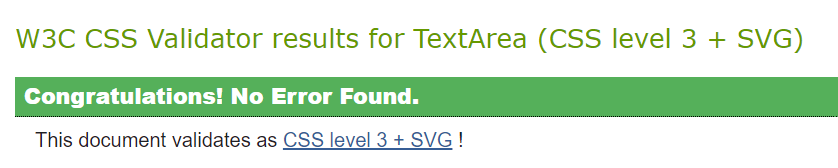

# Testing

## Manual testing

### Register

|Feature  | Expect  | Action | Result |
|--|--|--|--|
|Sign in link |When clicked the sign in link will direct the user to the sign in page | Clicked the sign in link | pass 
|Sign up form |When filled in correctly the sign up form will register an account for the user and direct to a verify your e-mail address page | Filled in form and clicked sign up button | pass 
|Sign up - information toast |When sign up form is submitted an information toast message will detail 'Confirmation email sent to users email' | Submitted sign up form | pass 
|Sign up - email |When sign up form is submitted with an email that is already registered then a pop up will detail 'A user is already registered with this e-mail address.' | Submitted sign up form with an email that is already registered | pass
|Sign up - email miss match |When sign up form is submitted with emails that don't match then a pop up will detail 'You must type the same email each time.' | Submitted sign up form with emails that do not match | pass 
|Sign up - username |When sign up form is submitted with a username that is already registered then a pop up will detail 'A user with that username already exists.' | Submitted sign up form with a username that is already registered | pass 
|Sign up - password |When sign up form is submitted with passwords that don't match then a pop up will detail 'You must type the same password each time.' | Submitted sign up form with passwords that do not match | pass 

### Login

|Feature  | Expect  | Action | Result |
|--|--|--|--|
|Sign up link |When clicked the sign up link will direct the user to the sign up page | Clicked the sign up link | pass 
|Sign in with Google |When clicked the Google link will direct the user to the google sign in page and once an account is chosen it will log the user into the site | Clicked the Google link | pass
|Sign in form |When valid information is submitted in the login form it will log that user into the site| Submitted login form with valid information | pass
|Sign in form - success toast |When user is logged into the site a success toast will pop up detailing 'Successfully signed in as user'| Submitted login form | pass
|Sign in form - incorrect login |If a users tries to use incorrect login details a pop up detailing 'The username and/or password you specified are not correct.'| Submitted login form with incorrect details | pass
|Forgot password link |When clicked the forgot password link will direct the user to the password reset page | Clicked the forgot password link | pass 
|Password reset form |When a valid email is submitted and the reset my password button is clicked a message detailing that an email has been sent to the user to reset password is displayed | Submit email in the password reset form | pass
|Password reset form - incorrect email |When an invalid email is submitted and the reset my password button is clicked a message detailing 'The e-mail address is not assigned to any user account' is displayed | Submit  invalid email in the password reset form | pass

###  Main navigation Bar

|Feature  | Expect  | Action | Result |
|--|--|--|--|
| Logo  | When the logo is clicked it will return the user to the home page |Clicked logo | pass
| All Products link| When clicked it will direct the user to the products page |Clicked All Products on the nav bar | pass
|Filter By dropdown link| When clicked it will open a dropdown that has Two options, Price (low to high) and Price (High to low)  |Clicked Filter By on the nav bar | pass
|Price (Low to high) link| When clicked it will direct the user to the products page with the products displayed by their price low to high |Clicked Price (low to high) on the nav bar | pass
|Price (High to low) link| When clicked it will direct the user to the products page with the products displayed by their price high to low |Clicked Price (High to low) on the nav bar | pass
| My Account dropdown link| When clicked it will open a dropdown that has Two options, Register and Login  |Clicked My Account on the nav bar | pass
|Register link |When clicked it will direct the user to the sign up page |Clicked Register link| pass
|Login link |When clicked it will direct the user to the sign in page |Clicked Login link| pass
|Search input - empty search |When an empty search is submitted an error message will appear detailing 'Please enter a search criteria!'  |Submitted an empty search criteria| pass
|Search input - Green |When a search criteria is submitted in this case 'Green' it will return all products with green in its name or description  |Submitted a 'Green' search criteria| pass
|Search input - Homemade |When a search criteria is submitted in this case 'Homemade' it will return all products with homemade in its name or description  |Submitted a 'Homemade' search criteria| pass
|Search results - Homemade |When a search criteria is submitted in this case 'Homemade' it will return a link to the main products page and detail how many products where found for the search query  |Submitted a 'Homemade' search criteria| pass
|Shopping bag icon |When clicked it will direct the user to the shopping bag page |Clicked the shopping bag icon on the nav bar| pass

### Category navigation bar 

|Feature  | Expect  | Action | Result |
|--|--|--|--|
|Bracelets link |When clicked it will direct the user to a list of all products that are of the bracelet category |Clicked the Bracelet link on the nav bar| pass
|Phone Charms link |When clicked it will direct the user to a list of all products that are of the phone charm category |Clicked the Phone Charm link on the nav bar| pass
|Earrings link |When clicked it will direct the user to a list of all products that are of the earrings category |Clicked the Earrings link on the nav bar| pass
|Necklaces link |When clicked it will direct the user to a list of all products that are of the necklace category |Clicked the Necklace link on the nav bar| pass
|Category link highlights |When clicked the current category that the user is browsing is highlighted in a dark pink colour |Clicked the category links on the nav bar| pass

### Logged in navigation bar

|Feature  | Expect  | Action | Result |
|--|--|--|--|
|My Account dropdown link |When logged in the My Account dropdown will show Profile and Logout when clicked |Clicked the My Account link on the nav bar| pass
|Profile link |When clicked it will direct the user to their profile |Clicked the Profile link on the nav bar| pass
|Logout link |When clicked it will direct the user to the logout page |Clicked the Logout link on the nav bar| pass

### Superuser navigation bar

|Feature  | Expect  | Action | Result |
|--|--|--|--|
|My Account dropdown link |When logged in as the superuser the My Account dropdown will show Admin Area, Profile and Logout when clicked |Clicked the My Account link on the nav bar| pass
|Admin Area link |When clicked it will direct the superuser to the admin area |Clicked the Admin Area link on the nav bar| pass

### Home page

|Feature  | Expect  | Action | Result |
|--|--|--|--|
|Shop Now button |When clicked it will direct the user to a list of all products |Clicked the Shop Now button| pass
|Custom Order button |When clicked it will direct the user to the custom order page |Clicked the Custom Order button| pass

### Products page

|Feature  | Expect  | Action | Result |
|--|--|--|--|
|Product image |When clicked it will direct the user to the product detail page |Clicked a product image| pass

### Products page - superuser

|Feature  | Expect  | Action | Result |
|--|--|--|--|
|Edit link |When a superuser is logged in an edit link will be displayed under each product, when clicked it will bring the superuser to the edit product page| clicked edit link | pass
|Delete link |When a superuser is logged in a delete link will be displayed under each product| Observed the delete link under each product | pass

### Product detail page
 
|Feature  | Expect  | Action | Result |
|--|--|--|--|
|Image clickable |When the image is clicked it will open in a new tab| Clicked image | pass
|Quantity selector - increment |When the increment button is clicked the quantity increases| Clicked the increment button on the quantity selector | pass
|Quantity selector - decrement |When the decrement button is clicked the quantity decreases| Clicked the decrement button on the quantity selector | pass
|Quantity selector - decrement disabled |When the quantity is 1 the decrement button on the quantity selector is disabled | Clicked the decrement button on the quantity selector when at 1 | pass
|Quantity selector - increment disabled |When the quantity is 50 the increment button on the quantity selector is disabled | Clicked the increment button on the quantity selector when at 50 | pass
|Keep Shopping button |When clicked the Keep Shopping button will direct the user to the all products page | Clicked the Keep Shopping button | pass
|Add to bag button |When clicked the Add to bag button will add the product to the users bag | Clicked the Add to bag button | pass
|Add to bag - shopping bag icon |When an item is added to the bag the price will increase under the shopping bag icon | Added product to bag and observed the shopping bag icon | pass
|Add to bag - toast |When an item is added to the bag a toast message will pop up detailing 'Product name has been added to your bag', the contents of the bag and a Go to Secure Checkout button | Added product to bag and observed the toast message | pass
|Secure Checkout button - toast |When the Go to Secure Checkout button is clicked it will direct the user to the shopping bag page| Clicked the Go to Secure Checkout button in the toast message | pass
|Increase quantity - toast message |When an item is added to the bag that is already in the bag the toast message will detail 'Updated product name to quantity x'| Add item to bag that is already in bag and observed the toast message | pass
|Reviews |Product reviews will be displayed below the product details| Observe the reviews section | pass

### Product detail - logged in user

|Feature  | Expect  | Action | Result |
|--|--|--|--|
|Leave a review |When user is logged in they can leave a review on a product | Review a product and clicked submit | pass
|Leave a review -  form validation |If a users submits a review with a required field left blank a message will detail 'Please fill in this field' | Leave message blank and clicked submit | pass
|Edit a review link |When user is logged in and they are the owner of the review they can edit the review. Clicking the edit link will open the edit review page | Clicked the edit link | pass 
|Edit a review - toast |When user is editing a review an information toast will pop up detailing 'You are editing a review posted by user' | Clicked the edit link and observed the toast message | pass 
|Editing a review |When on the edit review page the form should be prefilled with pervious review and can be updated when update is clicked| Clicked update on the edit review page | pass 
|Editing a review - success toast |When the review has been edited a success message will detail 'Successfully updated review'| Clicked update on the edit review page and observe toast message | pass
|Delete a review link |When user is logged in and they are the owner of the review they can delete the review. Clicking the delete link will remove the review | Clicked the delete link | pass 
|Delete a review - success toast |When the review has been deleted a success message will detail 'Review deleted!'| Clicked delete review and observe toast message | pass
|Average star rating |When a review is posted the star rating will contribute to the average rating displayed in the product detail| Add reviews and checked average star rating in product detail | pass

### Product detail  - superuser

|Feature  | Expect  | Action | Result |
|--|--|--|--|
|Edit link |When a superuser is logged in an edit link will be displayed under the price in the product detail page | Observed edit link | pass
|Delete link |When a superuser is logged in a delete link will be displayed under the price in the product detail page | Observed the delete link | pass

### Custom order page

|Feature  | Expect  | Action | Result |
|--|--|--|--|
|Custom order form |When form is filled in correctly and Place custom order is clicked a confirmation page will detail the price for the custom order | Filled in form and clicked Place custom order button | pass
|Custom order price |The price for the custom order will depend on the selections made by the user | Added different selections in the custom order form and checked the price differing | pass
|Custom order form - blank input validation |If Place custom order button is clicked with required fields left blank then a pop up will detail 'Please fill in this field' | Clicked Place custom order button and left colour scheme blank | pass
|Custom order form - Name validation |If Place custom order button is clicked with Personalised checked and the name field left blank then an error message will detail 'A name is required for personalised items' | Clicked Place custom order button and left name blank | pass
|All products button |When clicked the all products button will direct the user to the products page  | Clicked the all products button | pass
|Add to Bag button |When clicked the Add to Bag button will add the custom order to the bag and navigate to the shopping bag page | Clicked the Add to Bag button | pass
|Add to bag - toast |When a custom order is added to the bag a toast message will pop up detailing 'Custom order has been added to your bag', the contents of the bag and a Go to Secure Checkout button | Added custom order to bag and observed the toast message | pass
|Keep Shopping button |When clicked the Keep Shopping button will direct the user to the products page | Clicked the Keep Shopping button | pass

### Shopping bag page

|Feature  | Expect  | Action | Result |
|--|--|--|--|
|Quantity selector - increment |When the increment button is clicked the quantity increases for different products in the shopping bag| Clicked the increment button on the quantity selector of multiple items in the bag | pass
|Quantity selector - decrement |When the decrement button is clicked the quantity decreases for different products in the shopping bag| Clicked the decrement button on the quantity selector of multiple items in the bag | pass
|Quantity selector - decrement disabled |When the quantity is 1 the decrement button on the quantity selector is disabled for different products in the shopping bag | Clicked the decrement button on the quantity selector when at 1 for multiple items in the bag | pass
|Quantity selector - increment disabled |When the quantity is 50 the increment button on the quantity selector is disabled for different products in the shopping bag | Clicked the increment button on the quantity selector when at 50 for multiple items in the bag | pass
|Update button |When clicked the update button will update the quantity of the product or the custom order of the item that the quantity selector is associated with and the add to bag success toast message will be displayed | Changed the quantity of the custom order and clicked update and changed the quantity of the product and clicked update | pass
|Remove button |When clicked the remove button will remove the product or the custom order from the bag and the add to bag success toast message will be displayed | Clicked the remove button of the custom order and a product | pass
|Delivery charge |When items are added to the bag the delivery charge should be calculated at 10% of the grand total and displayed above the grand total on the shopping bag page |Added different items to the bag and checked the delivery charge | pass
|Keep Shopping button |When clicked the Keep Shopping button will direct the user to the products page | Clicked the Keep Shopping button | pass
|Secure Checkout button |When clicked the Secure Checkout button will direct the user to the checkout page | Clicked the Secure Checkout button | pass

### Checkout page

|Feature  | Expect  | Action | Result |
|--|--|--|--|
|Order Summary |On the checkout page the order summary should be displayed with the items that the user wants to checkout | Add different items to the bag and clicked Secure Checkout, check the order summary to make sure the items from the bag corresponds to the order summary | pass 
|Order total, Delivery and Grand total |On the checkout page the order total, delivery and grand total should be displayed under the order summary | Add different items to the bag and clicked Secure Checkout, check the order total, delivery and grand total | pass 
|Checkout form |When filled in correctly and Complete Order is clicked an order with the users items is created and user is navigated to the checkout success page | Fill in checkout form and click Complete Order | pass 
|Checkout form - validation |If the form is submitted and a required field is left blank a pop up will detail 'Please fill in this field'| Submit checkout form with the email address field left blank | pass
|Create an account link |Under the delivery details of the checkout form the user is asked to create an account to save their delivery information, when clicked it will navigate to the sign up page| Clicked create an account link | pass
|Login link |Under the delivery details of the checkout form the user is asked to login to save their delivery information, when clicked it will navigate to the sign in page| Clicked login link | pass
|Payment input |Entering an incorrect card number will result in an error message 'Your card number is invalid'| Entered 9999999999999999 in the payment input | pass
|Checkout success - toast |After checking out products a checkout success message should be displayed containing the users order number and that a confirmation message is sent via email | Checked out order and observed success toast message | pass
|Confirmation email |After checking out products an email is sent to the user confirming details of their order | Checked out order and check for received confirmation email | pass

### Checkout page - logged in user 

|Feature  | Expect  | Action | Result |
|--|--|--|--|
|Save delivery information to my profile checkbox |When this checkbox is clicked it will save the users default delivery information | Checkout with this checkbox clicked and check users profile, observe default delivery information | pass 

### Checkout success page

|Feature  | Expect  | Action | Result |
|--|--|--|--|
|Order thank you message |An order confirmation including where the confirmation email would be sent, the order number and the date of the order will be displayed on the checkout success page | Checkout an order an observe the thank you message | pass 
|Your order |An order summary will be displayed in the checkout success page, to include the order, subtotal and grand total | Checkout an order an observe your order section | pass 
|Delivery info |The users delivery information will be displayed on the checkout success page | Checkout an order an observe the delivery info section | pass

### Profile

|Feature  | Expect  | Action | Result |
|--|--|--|--|
|Update information button |When clicked the update information button will update the users default delivery information| Updated delivery information and clicked update information button | pass 
|Order history |When a user is logged in and places an order they will be able to see their order history in the profile page| Placed an order and observed the order history| pass
|Order number clickable |When an order number in the order history is clicked it will direct the user back to the checkout success page with an information toast stating that this is a past order confirmation | Clicked an order number in the order history| pass

### Contact us

|Feature  | Expect  | Action | Result |
|--|--|--|--|
|Contact us form |When submitted with valid information the contact us form will leave a message for admin in the admin panel| Submit contact us form with valid information| pass
|Contact us form - required inputs |When contact us form submitted with a required field left blank a pop up will detail 'Please fill in this field'| Submit contact us form with full name field left blank| pass
|Contact us form - invalid email |When submitted with an invalid email a pop up will detail 'Please include an '@' in the email address'| Submit contact us form with invalid email| pass

### Admin area

|Feature  | Expect  | Action | Result |
|--|--|--|--|
|Product management - Add a product |When add a product form is filled out correctly and Add product button is clicked a new product will be added to the site |Filled in add product form and clicked add product| pass
|Add a product - required inputs |When add a product form is submitted with a required field left blank a pop up will detail 'Pease fill in this field' |Filled in add product form and left description blank| pass
|Add a product - price |When add a product form is submitted with invalid data in the price field a message will detail 'Ensure that there are no more than 4 digits before the decimal point.' |Add price of 125635 in the add product form| pass
|Add a product - URL |When add a product form is submitted with invalid URL a message will detail 'Please enter a URL' |Add invalid URL in the add product form| pass
|Cancel button |When cancel button is clicked it will direct the superuser to the products page |Clicked cancel button| pass
|Edit product |When edit link is clicked it will open a prefilled form with the products details, when edit product button is clicked this will update the details of the product and return superuser to the product detail page  |Updated the edit a product form and clicked edit product| pass
|Edit product - success toast |When product is edited a success toast will detail 'Successfully updated product'| Edited a product | pass
|Delete product |When the delete link is clicked it will remove the product from the site| Clicked delete link | pass
|Delete product - success toast |When product is deleted a success toast will detail 'Deleted product'| Delete a product | pass
|User messages |When user fills in contact us form the message will be displayed in the admin area| Observed user messages in admin area | pass

### Footer

|Feature  | Expect  | Action | Result |
|--|--|--|--|
|Facebook link |When the Facebook icon is clicked it will open the Facebook business page in a new tab | Clicked Facebook icon| pass
|Instagram link |When the Instagram icon is clicked it will open Instagram in a new tab | Clicked Instagram icon| pass
|Contact us link |When the contact us link is clicked it will direct users to the contact us page | Clicked contact us link| pass
|Mailchimp subscription form |When email is added to Mailchimp it will add the users email to an email marketing service| Added email to Mailchimp form and checked Mailchimp to see if email is in subscriber list| pass

### Logout

|Feature  | Expect  | Action | Result |
|--|--|--|--|
|Logout |When logout is selected in My Account dropdown in the navigation bar a messaged will appear confirming if the user would like to sign out | Clicked logout in the My Account dropdown navigation bar| pass
|Sign out button |When sign out button is clicked the user will be signed out and directed to the home page | Clicked sign out button| pass
|Logout - success toast |When signed out a success message will detail 'Successfully signed out' | Clicked sign out button| pass

## Validator Testing

### HTML

No errors were returned when all HTML pages where passed through the official [W3C Validator](https://validator.w3.org/nu/?doc=https%3A%2F%2Fjenas-creations-ad878282c6a4.herokuapp.com%2F#l101c14)

### CSS

No errors were returned when the CSS was passed through the official [Jigsaw validator](https://jigsaw.w3.org/css-validator/)

### Lighthouse Testing

Lighthouse was run to audit performance, accessibility, best practices and SEO for the entire site.

### CI Python Linter

All relevant Python files in this project where passed through the [CI Python Linter](https://pep8ci.herokuapp.com/#)

#### Bag app

contexts.py

urls.py

views.py

